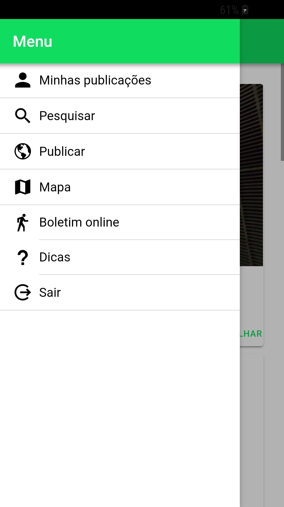

# Desaparecidos
App "desaparecidos" frontend e backend

**App de busca de pessoas desaparecidas**

  
  
  
  

**Tecnoligias usadas (Backend)**

Nodejs 

Expressjs 

MySQL 

**Tecnoligias usadas (Frontend)**

Ionic 4

Angular 6

CSS 3 

